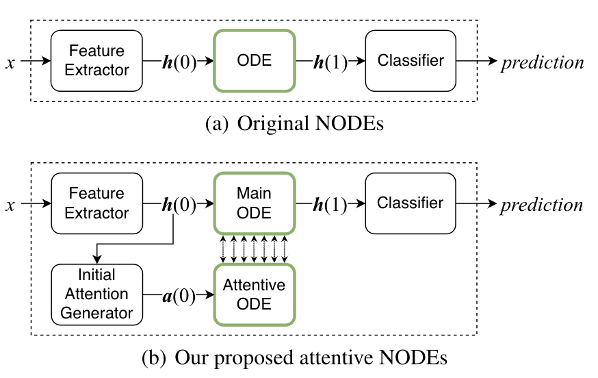

# Attentive Co-Evolving ODE :: ACE-NODE

This study aims to predict more accurately by adding the attention technique to the neural ode.

<p align="center">
   
</p>


# Our Baseline 

## Neural ODE
Those `examples` directory contains cleaned up code regarding the usage of adaptive ODE solvers in machine learning. The scripts in this directory assume that `torchdiffeq` is installed following instructions from the main directory.
MNIST
```
python3 atten_ode_mnist.py 
```
CIFAR10
```
python3 atten_ode_cifar10.py 
```
SVHN
```
python3 atten_ode_svhn.py 
```
## GRU-ODE-Baeyes
USHCN-daily
```
python3 climate_gruode_atten.py --lr 0.05 --weight_decay 0.001 --nepochs 200
```
If you want to know more details about USHCN-daily, go to USHCN-daily folder 

## Latent_ODE 
Physionet
```
python3 run_models.py  --niters 20 -n 8000 -l 20 --dataset physionet --attentive-ode --rec-dims 40 --rec-layers 3 --gen-layers 3 --units 50 --gru-units 50 --quantization 0.016 --classif

```
If you want to know more details about Physionet, go to Physionet folder 

